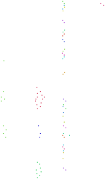
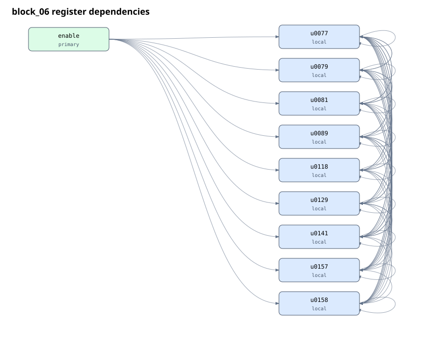
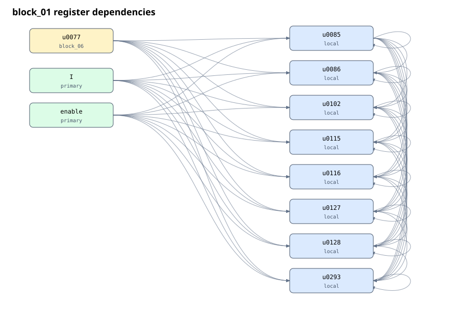
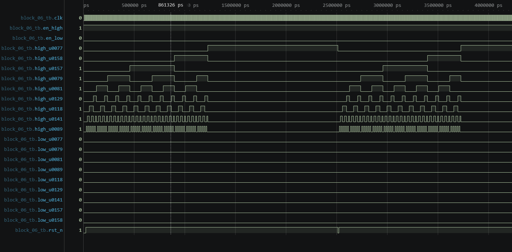
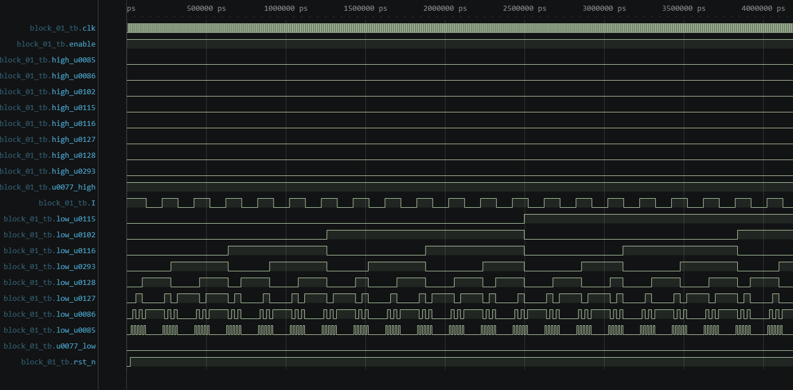
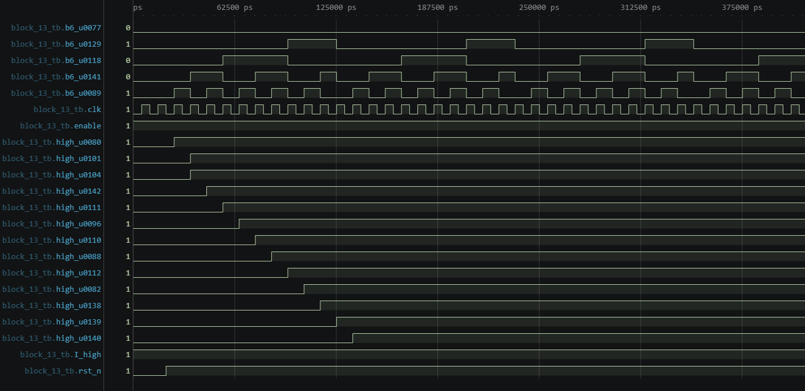
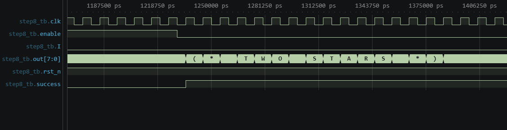
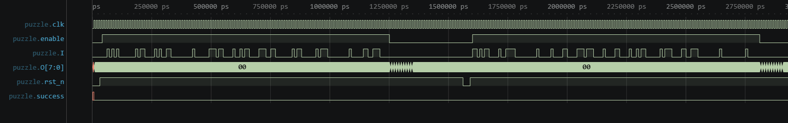
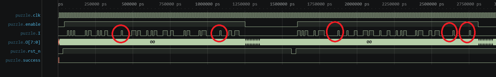

# Solution for Jane Street ASIC Puzzle 2026

The basic idea is:  
First, based on the register dependency graph and gds layout, split the circuit into some smaller blocks and analyze them one by one.  
After getting a rough idea of the overall structure, use a SAT solver to solve it in a formal way.

## Tools

- Python 3.10.12
- KLayout 0.30.10 (KLayout provides 'klayout.db' for Python to import)
- Icarus Verilog 13.0
- MiniSat

## Libraries

- `third_party/sky130_klayout_pdk`: efabless SKY130 KLayout deck
- `third_party/skywater-pdk-libs-sky130_fd_sc_hd`: Google SKY130 standard-cell models

## Detailed Steps

### Step 1: Use KLayout to convert GDS into CIR

When I first saw the challenge, I actually considered whether I should do transistor-level analysis or subcircuit matching. But after opening the GDS, I found that this GDS was not flattened. Eh, then everything became much more convenient.  
Here, I used the script [`step1_extract_cir.sh`](code/step1_extract_cir.sh). It makes use of the LVS script provided by Efabless and can convert the GDS into CIR. This CIR file is a text file that describes how all the logic gates in the circuit are connected with each other. This makes the analysis much easier.  
At the same time, in order to keep the layout information, I also generated an .lvsdb file. This is also a text file, and it contains the position of all the logic gates in the circuit. We may use this position information in the later analysis.

### Step 2: Convert CIR into Verilog

For our later analysis, the readability of CIR is still quite low. So I generated [`step2_cir_to_verilog.py`](code/step2_cir_to_verilog.py) to convert the CIR into a Verilog netlist. The position information is also imported into the netlist as comments.

### Step 3: Build a directed dependency graph of the FFs (flip-flops), inputs and outputs

Before partitioning the circuit into blocks, we first build a directed graph to make the analysis easier. Here, we treat the FFs, inputs, and outputs as nodes, and the gates between nodes as directed edges.  
I generated [`step3_build_dependency_graph.py`](code/step3_build_dependency_graph.py) to generate this kind of directed graph.

### Step 4: Remove nodes unrelated to success

The puzzle description mentions that we do not need to care about the text generator during the analysis. Therefore, we start from the success output and perform a backward BFS (breadth-first search) to find all the nodes that can affect success.  
Then, we use these nodes to form a subgraph and output both the dependency graph and the simplified Verilog netlist. This process is done by [`step4_prune.py`](code/step4_prune.py).

### Step 5: Split the circuit into small blocks based on strongly connected components and positions

At the beginning, I tried to partition the circuit into small blocks only using strongly connected components. I divided the FFs into several groups. However, I found that there were many scattered FFs.  
Therefore, later I also added position-based clustering using the positions from the GDS. After clustering the scattered FFs together, we got 27 blocks. This process is done by [`step5_partition.py`](code/step5_partition.py).  
These groups are visualized in the following image.



### Step 6a: Generate dependencies between the small blocks and analyze them

We use [`step6a_blocks.py`](code/step6/step6a_blocks.py) to visualize the dependencies between the blocks and obtain the Verilog netlist of each block.  
The first thing we noticed is that, as shown in the graph, block6 only depends on `enable`. And block1 only depends on `u0077` in block6 and `enable` and `I`.





So we first analyze block6, and then block1.

### Step 6b: Analyze the function of each block

For blocks with only a few dependencies, it's easier to understand their functions by simulation. For blocks with more dependencies, we need to analyze the netlist or use SAT to solve them.

#### 6b1: Analyze block6

Because block6 only depends on external input, we can directly simulate it.



We found that it is a counter, but it is not a normal binary counter, which is a little strange. Its function is to pull `u0077` high after counting 121 clock cycles.

#### 6b2: Analyze block1

We simulate block1 because it only depends on `enable`, `I`, and `u0077`. `u0077` is set to high or low.



We found that this block is also a counter. When `u0077` is low, it counts how many times the input `I` is high.

#### 6b3: Analyze block13

Then, we simulate block13. We observed that it only depends on block6, `I`, and `enable`. So we connected it with block6 and ran simulation with the waveform of I being all 1s or all 0s.



It looks like a shift register, but somehow one bit is repeated? Also, the dependency on block6 is not reflected at all. `u0101` and `u0104` seem to be repeated.  
After reading the Verilog netlist, it seems that `u0104` is in the shift register, while `u0101` is not. And the ticking of the shift register is controlled by `enable`, `u0077`.  
Based on the information above, for now we treat `u0077` as the finish signal, and assume that `enable` is always 1.  
During the analysis of 6b3, we also found that block6 can be understood as a two-round counter. Both the lower four bits and the higher four bits count from 0 to 10.  
After analysis, the final set condition of `u0101` is:

```
when input is true
    if counter_low == 0,
        I from 10 or 11 ticks before is 1
    or if counter_low == 6,
        I from 1, 11, or 12 ticks before is 1
    otherwise,
        I from 1, 10, 11, or 12 ticks before is 1

then
    set u0101
```

#### 6b4: Analyze the 3FF block07

For that 3FF block, block07, we directly analyze its Verilog.  
To simplify the analysis, we first set `enable` to 1 and `finish` to 0. We observed that the two FFs count the high values of `I`, and when the counter is 6, their state is checked and reset. In this way, the input history is reduced to only two state bits, so now we can easily analyze the state transitions.  
From the state transitions, we can see that this is a 2-bit counter and a self-locking FF. The 2-bit counter will be reset when block6 counts to 6. If it has already counted two high values of `I` before the reset happens, the self-locking FF will enter the locked state and keep itself locked.

#### 6b5: Remaining 2FF blocks

For the 2FF blocks, block26 depends on almost all the other blocks, and we observed that its output goes to success.  
By reading the Verilog, we can find that one FF, `u0144`, is a self-locking FF that depends on either finish or itself. Then, for the remaining FF `u0103`, we can simply try the two cases of `u0144 = 0` and `u0144 = 1`.  
Therefore, we can use SAT solver* to find out what value each module needs to have when success is high.  
The outputs of all the other 2FF blocks only depend on block6, `I`, and `enable`.  
Until now, we have already analyzed enough blocks. So we can reach the conclusion that the circuit takes a 121-bit input sequence, and then tries to detect whether this input sequence satisfies some specific conditions.

\* SAT(Boolean satisfiability) solver is a tool that is given a Boolean formula and determines whether there is an assignment of variables that makes the formula true. It can also solve out this variable assignment.

### Step 7: Use SAT to solve it

After understand the function of each block, we can use SAT to solve the input sequence that makes success high.  
We used MiniSat to perform BMC (bounded model checking). The script used here is [`step7_bmc.py`](code/step7_bmc.py).

The constraints are:  
the circuit starts from all 0, `enable` is always high, and all the bits in the 121-cycle input sequence are free variables.  
To solve:  
what input sequence can make success become high.

Finally, we solved out one sequence that satisfies all the conditions.

### Step 8: Run the simulation and get the output string

Using the netlist obtained in Step 2 and the input sequence found in Step 7, we run the simulation and get the following output string:

```
(* TWO STARS *)
```



At this point, the challenge is solved.


## Finding the Easter eggs

During the simulation, I found that if the input is all 0s, the output is `EMPTY SKY`. So maybe there are more possible outputs hidden inside the circuit.

### Step 9: Use formal method to verify

Using SAT, we ask whether the first output char can have any value other than the already-known values. We search for a first char that does not belong to `EMPTY SKY, TRY AGAIN, (* TWO STARS *)`.

Whenever a new first char is found, we add it to the constraints and continue solving, until all possible first chars have been found. After finding a new first char, we use the new input pattern to get the  output string.

Finally, we found that the circuit can output the following strings:

```
(* TWO STARS *)
BIG BANG
EMPTY SKY
TRY AGAIN
```

### Step 10: Avoid missed outputs

To avoid missing other strings that have the same first char, we add more constraints. For every possible first char, we constrain the following eight chars to check whether there are still some new outputs.

Then, we found one more output:

```
TWO NOT TOUCH
```

### Besides...

The input in the example VCD does not look very random, right?



It looks a little bit like UART data when transmitting text if we ignore the idle parts.

Notice that there are five similar 1-cycle short pulses.



If we assume that these pulses represent spaces, then what is the remaining data?


Yes, it is a string.

```
The night sky awaits
```
